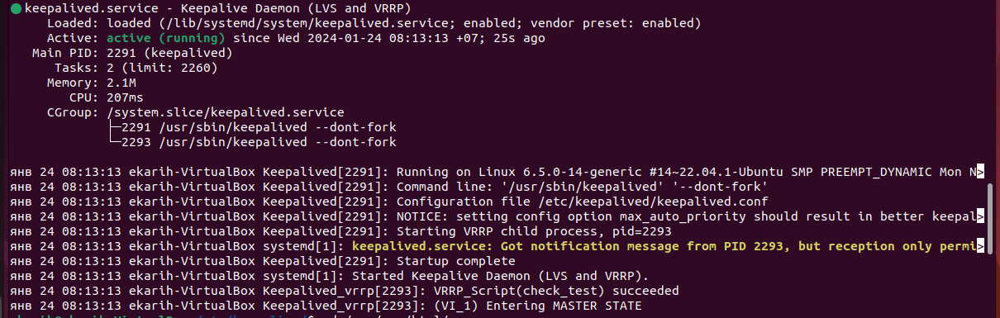

## Домашнее задание к занятию "Disaster Recovery. FHRP и Keepalived" - Карих Елена
---
### Задание 1

Дана схема для Cisco Packet Tracer, рассматриваемая в лекции.
На данной схеме уже настроено отслеживание интерфейсов маршрутизаторов Gi0/1 (для нулевой группы)
1. Необходимо аналогично настроить отслеживание состояния интерфейсов Gi0/0 (для первой группы).
2. Для проверки корректности настройки, разорвите один из кабелей между одним из маршрутизаторов и Switch0 и запустите ping между PC0 и Server0.
На проверку отправьте получившуюся схему в формате pkt и скриншот, где виден процесс настройки маршрутизатора.

### Решение 1
* ссылка на схему [hsrp_task1_ekarih.pkt](hsrp_task1_ekarih.pkt)

---
### Задание 2

1. Запустите две виртуальные машины Linux, установите и настройте сервис Keepalived как в лекции, используя пример конфигурационного файла.
2. Настройте любой веб-сервер (например, nginx или simple python server) на двух виртуальных машинах
3. Напишите Bash-скрипт, который будет проверять доступность порта данного веб-сервера и существование файла index.html в root-директории данного веб-сервера.
4. Настройте Keepalived так, чтобы он запускал данный скрипт каждые 3 секунды и переносил виртуальный IP на другой сервер, если bash-скрипт завершался с кодом, отличным от нуля (то есть порт веб-сервера был недоступен или отсутствовал index.html). Используйте для этого секцию vrrp_script
5. На проверку отправьте получившейся bash-скрипт и конфигурационный файл keepalived, а также скриншот с демонстрацией переезда плавающего ip на другой сервер в случае недоступности порта или файла index.html

### Решение 2
1. Запустила 2 ВМ ubuntu2 (IP 192.168.1.132), ubuntu3 (IP 192.168.1.33), установила Keepalived

2. Установила Nginx на оба
3. Bash-скрипт:
```
#!/bin/bash

if [[ $(ss -tuln | grep LISTEN | grep :80) ]] && [[ -f /var/www/html/index.html ]]; then
exit 0
else
exit 1
fi

```

4. Конфигурационный файл keepalived.conf:
```
global_defs {
    enable_script_security
}
vrrp_script check_test {
    script "/etc/keepalived/keepaliv_script.sh"
    interval 3
    user root
}

vrrp_instance VI_1 {
    state MASTER
    interface enp0s8
    virtual_router_id 55
    priority 255
    advert_int 1

    virtual_ipaddress {
        192.168.1.55/24
        }
    track_script {
        check_test
        }
}
```
5. Для проверки удалила файл index.html, и увидела переход на вторую ВМ:


Простите, страница осталась после предыдущего ДЗ(( не стала исправлять..так сразу понятно что это на ВМ))
---
